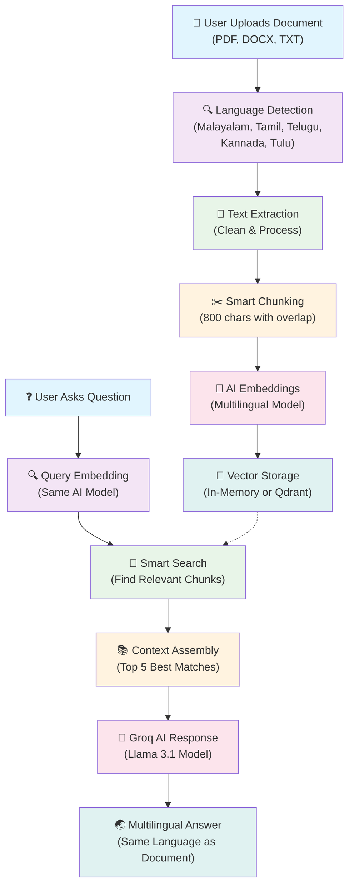

# 🌏 South Indian Multilingual Document QA Chatbot

Interactively explore Malayalam, Tamil, Telugu, Kannada and Tulu documents with a production-ready Retrieval-Augmented Generation (RAG) assistant. Upload folders of files, filter by language/source/date, switch answer formats, export curated snippets, and share read-only chats—all powered by Groq LLMs, Qdrant vector search, and a resilient OCR stack.

---

## ✨ Feature Highlights

- **Batch-aware ingestion** – drag & drop entire folders, track progress, skip duplicates, and capture metadata (language, upload time, size) per document.
- **Retrieval filters** – constrain answers by language, specific filenames, or upload date windows without re-indexing content.
- **Answer modes** – toggle between `Concise`, `Detailed with citations`, `Bullet summary`, and `Step-by-step` for the same query.
- **Exports & sharing** – download Markdown dossiers of selected Q&A pairs and generate read-only share links (`?share=<token>`).
- **Workspace glossary** – automatically surface key terms with contextual definitions extracted from ingested content.
- **Code-mixed query handling** – detect Latin-script “Tanglish” queries and transliterate into native scripts before retrieval.
- **Modern retrieval stack** – multilingual-e5-large embeddings, optional cosine normalisation, and bge-reranker-large cross-encoder reranking.
- **Robust OCR** – tiered fallbacks from pdfplumber/docx2txt to Tesseract and PaddleOCR for layout-heavy scans and images.

---

## 🏛️ Architecture Overview

```text
User Uploads ─┐
              │    ┌────────────────────────────┐
              ├──▶ │ Ingestion Flow             │
              │    │ • Text extraction (PDF/DOCX/TXT/Image)│
              │    │ • Cleaning, chunking, metadata        │
              │    └──────────────┬────────────────────────┘
              │                   │
Sidebar Filters ───────────────┐  │          ┌──────────────────┐
 Answer Modes ───────────────┐ │  │          │ Retrieval Engine │
 Share / Export ────────────┐ │  │          │ • Embed query     │
 Glossary ─────────────────┐ │  │          │ • Qdrant search    │
                            ▼ ▼  ▼          │ • MMR + reranker  │
                        Streamlit Chat UI   └────────┬──────────┘
                                    │               │
                                    ▼               ▼
                               Groq LLM API   Workspace Glossary
                                    │
                           Answer formatting + citations
```

### Why these design choices?

- **Intfloat/multilingual-e5-large embeddings** deliver strong multilingual coverage; query/document prefixes align with the model’s pre-training objective.  
- **Cross-encoder reranking** (`BAAI/bge-reranker-large`) improves precision when multiple near-duplicate passages are retrieved.  
- **Language/source/date filters** let subject-matter experts interrogate specific document sets without re-uploading files.  
- **Answer modes** adapt responses to stakeholders—from high-level briefs to evidence-heavy reports.  
- **PaddleOCR fallback** captures complex layouts that Tesseract misses, protecting recall on scanned multilingual PDFs.  
- **Share tokens** encode session state in the URL, enabling reviewers to see exactly what was answered—no API key or reprocessing required.

---

## 📂 Project Structure

```
Multilingual_DOC_BOT/
├── main.py              # Streamlit UI, batch ingest, filters, exports, sharing
├── rag_pipeline.py      # Retrieval engine (embeddings, Qdrant/memory, reranking)
├── llm_handler.py       # Groq integration, multilingual prompt orchestration
├── utils.py             # OCR, text extraction, language detection, glossary helpers
├── test_project.py      # Regression harness covering ingestion→answer flow
├── requirements.txt     # Python dependencies
├── env.example          # Environment variable template
└── README.md            # This document
```

The repository now contains only essential runtime, configuration, and documentation files—ready to push to [`siv3sh/Multilingual_DOC_BOT`](https://github.com/siv3sh/Multilingual_DOC_BOT.git).

---

## 🚀 Quick Start

### 1. Clone & install

```bash
git clone https://github.com/siv3sh/Multilingual_DOC_BOT.git
cd Multilingual_DOC_BOT
python -m venv .venv
source .venv/bin/activate  # Windows: .venv\Scripts\activate
pip install --upgrade pip
pip install -r requirements.txt
```

> **PaddleOCR** ships large wheels. On Windows you may need to follow [PaddleOCR installation guidance](https://github.com/PaddlePaddle/PaddleOCR) if binary wheels are unavailable for your Python version.

### 2. Provision external services

| Service | Purpose | Quick start |
| --- | --- | --- |
| Groq API | LLM responses | Create key at <https://console.groq.com/keys> |
| Qdrant | Vector store | `docker run -p 6333:6333 qdrant/qdrant` or use Qdrant Cloud |
| Tesseract OCR | Image/scan support | Install via `brew`, `apt`, or UB Mannheim Windows build |

### 3. Configure environment

```bash
cp env.example .env
# edit .env to set GROQ_API_KEY, QDRANT_URL, etc.
```

Key variables:

| Variable | Description | Default |
| --- | --- | --- |
| `GROQ_API_KEY`* | Groq API key | – |
| `GROQ_MODEL` | Groq deployment name | `llama-3.1-8b-instant` |
| `QDRANT_URL` | Vector endpoint | `http://localhost:6333` |
| `QDRANT_COLLECTION_NAME` | Collection name | `multilingual_docs` |
| `EMBEDDING_MODEL` | Sentence-transformer ID | `intfloat/multilingual-e5-large` |
| `EMBEDDING_NORMALIZE` | Cosine normalisation toggle | `true` |
| `RERANKER_MODEL` | Cross-encoder identifier | `BAAI/bge-reranker-large` |

### 4. Launch Streamlit

```bash
streamlit run main.py
```

Open <http://localhost:8501>, paste your Groq key in the sidebar, and you’re ready to ingest documents.

---

## 💡 Using the App

### Batch ingestion
- Drag in multiple files/folders; progress bars show ingestion status.  
- Duplicate filenames are skipped automatically.  
- Each document stores language, upload time, chunk counts, and optional glossary entries.

### Retrieval filters
- **Languages** – limit search to selected scripts (e.g., Malayalm + Tamil).  
- **Sources** – pick specific files for context.  
- **Date range** – restrict retrieval to documents uploaded within a window.

### Answer modes

| Mode | Best for | Behaviour |
| --- | --- | --- |
| Concise | Executive summaries | ≤3 sentences covering essentials |
| Detailed with citations | Compliance / research | Paragraph answers citing `[source: filename #chunk]` |
| Bullet summary | Slide decks / briefs | Bullet list of evidence-backed facts |
| Step-by-step | Procedures / reasoning | Numbered reasoning steps from context to conclusion |

### Exports & sharing
- Select Q&A pairs → download Markdown dossier.  
- Generate shareable links; recipients view the conversation in read-only mode (no key required).

### Glossary
- Automatic key-term extraction on ingestion.  
- Search inside the glossary expander to jump to relevant terminology quickly.

### Code-mixed queries
- Latin-script queries are analysed for non-English content.  
- When transliteration improves retrieval quality, the UI notes that a transliterated variant was used.

---

## 🔍 Retrieval Pipeline Deep Dive

1. **Embedding** – text is prefixed (`passage:`/`query:`) to match multilingual-e5-large expectations and optionally normalised for cosine similarity.  
2. **Storage** – Qdrant (or an in-memory fallback) hosts chunk vectors with detailed payload metadata.  
3. **MMR diversification** – initial top-`k`×3 hits are pruned using Maximal Marginal Relevance to avoid duplicate evidence.  
4. **Cross-encoder reranking** – bge-reranker-large re-evaluates candidate contexts for final ordering.  
5. **Answer synthesis** – Groq LLM receives context, query, language lock, and answer-mode instructions to produce the final response with citations.

---

## 🧪 Testing

Run the built-in regression harness:

```bash
python test_project.py
```

- Automatically skips LLM-dependent tests when `GROQ_API_KEY` is absent.  
- Covers import sanity, text processing, retrieval, reranking, Groq connectivity, and multilingual outputs.  
- Extend via `pytest` as needed.

---

## 📦 Deployment Notes

- **Caching**: integrate Redis (`REDIS_URL`, `CACHE_TTL_SECONDS`) to memoize embeddings and responses—ideal when fronting Streamlit with FastAPI/Nginx.  
- **Rate limiting**: pair Streamlit behind a proxy using `slowapi` or Nginx rate limiting to prevent key abuse.  
- **Observability**: add OpenTelemetry exporters or Sentry in `main.py` to trace ingestion/retrieval latencies when deploying at scale.

---

## 📤 Publishing to GitHub

```bash
git init
git remote add origin https://github.com/siv3sh/Multilingual_DOC_BOT.git
git add .
git commit -m "Initial clean RAG chatbot import"
git push -u origin main
```

> 🔐 Keep `.env` and API keys out of version control. The included `.gitignore` already excludes the common secret files.

---

## 🙏 Acknowledgements

- [Groq](https://groq.com/) for ultra-low-latency LLM inference.  
- [Qdrant](https://qdrant.tech/) for scalable vector search.  
- [SentenceTransformers](https://www.sbert.net/) & [Hugging Face](https://huggingface.co/) for multilingual embeddings and rerankers.  
- [PaddleOCR](https://github.com/PaddlePaddle/PaddleOCR) & Tesseract maintainers for comprehensive OCR coverage.

Built with ❤️ for the South Indian language community.
# 🌏 South Indian Multilingual Document QA Chatbot

A production-grade Streamlit application that enables users to upload documents in South Indian languages (Malayalam, Tamil, Telugu, Kannada, Tulu) and ask questions about them using advanced RAG (Retrieval-Augmented Generation) technology powered by Groq LLMs and Qdrant vector database.

## ✨ Features

- **Multilingual Support**: Automatically detects and processes documents in Malayalam, Tamil, Telugu, Kannada, and Tulu
- **Document Processing**: Supports PDF, DOCX, TXT, and **Image files** (JPG, PNG, BMP, GIF, TIFF)
- **OCR Support**: Extracts text from images and scanned documents using Tesseract OCR with Indic language support
- **Advanced RAG Pipeline**: Uses sentence-transformers for multilingual embeddings and Qdrant for vector storage
- **Groq LLM Integration**: Powered by state-of-the-art models like Mixtral-8x7B and Llama3-70B
- **Language-Aware Responses**: Always responds in the same language as the uploaded document
- **Clean UI**: Modern Streamlit interface with chat functionality
- **Batch Workspace Management**: Drag-and-drop folders, filter by language/source/date, and view ingestion progress
- **Answer Controls**: Switch between concise replies, detailed answers with citations, bullet summaries, or step-by-step reasoning
- **Collaboration Tools**: Export curated snippets to Markdown, generate shareable read-only chat links, and browse an auto-built glossary

## 🏗️ Architecture



### 🎯 How It Works (Simple Explanation)

1. **📄 Upload**: You upload a document in any South Indian language
2. **🔍 Detect**: The system automatically detects the language (Malayalam, Tamil, Telugu, Kannada, or Tulu)
3. **📝 Extract**: Text is extracted and cleaned from your document
4. **✂️ Chunk**: The text is broken into smart pieces for better understanding
5. **🧠 Learn**: AI creates "fingerprints" (embeddings) of each piece
6. **💾 Store**: These fingerprints are stored for quick retrieval
7. **❓ Question**: When you ask a question, the system finds the most relevant pieces
8. **🤖 Answer**: Groq AI generates a comprehensive answer in the same language as your document

**The magic happens in steps 5-7**: The AI understands the meaning of your question and finds the most relevant parts of your document to give you accurate answers!

## 📋 Prerequisites

- Python 3.8 or higher
- Groq API key (get from [Groq Console](https://console.groq.com/keys))
- Qdrant instance (local or cloud)
- **Tesseract OCR** (required for image and scanned document processing)

## 🚀 Quick Start

### 1. Clone and Setup

```bash
git clone <repository-url>
cd doc_llm
```

### 2. Install Dependencies

```bash
pip install -r requirements.txt
```

### 2.1. Install Tesseract OCR (for image support)

**macOS:**
```bash
brew install tesseract tesseract-lang
```

**Ubuntu/Debian:**
```bash
sudo apt-get update
sudo apt-get install tesseract-ocr tesseract-ocr-eng tesseract-ocr-hin \
  tesseract-ocr-mal tesseract-ocr-tam tesseract-ocr-tel tesseract-ocr-kan
```

#### Optional: PaddleOCR (improves layout-heavy OCR)

```bash
pip install "paddleocr>=2.7.0.3" "paddlepaddle>=2.5.2"
```

> PaddleOCR is optional; the app will automatically fall back to it when available.

**Windows:**
- Download installer from: https://github.com/UB-Mannheim/tesseract/wiki
- Add Tesseract to your system PATH
- Install language packs during installation

### 3. Setup Qdrant

#### Option A: Local Qdrant (Recommended for development)

```bash
# Using Docker
docker run -p 6333:6333 qdrant/qdrant

# Or using pip
pip install qdrant-client
```

#### Option B: Qdrant Cloud

1. Sign up at [Qdrant Cloud](https://cloud.qdrant.io/)
2. Create a cluster
3. Get your cluster URL and API key

### 4. Configure Environment

```bash
# Copy the example environment file
cp env.example .env

# Edit .env with your actual values
GROQ_API_KEY=your_actual_groq_api_key
QDRANT_URL=http://localhost:6333  # or your cloud URL
```

**⚠️ Important**: Replace `your_groq_api_key_here` with your actual Groq API key from [Groq Console](https://console.groq.com/keys)

> 🔒 **Security Tip:** The application no longer ships with a placeholder API key. You must supply a valid key through `.env`, Streamlit secrets, or the in-app sidebar before uploading documents.

### 5. Run the Application

```bash
streamlit run main.py
```

The application will be available at `http://localhost:8501`

## 🔧 Configuration

### Environment Variables

| Variable | Description | Default |
|----------|-------------|---------|
| `GROQ_API_KEY` | Your Groq API key | Required |
| `QDRANT_URL` | Qdrant server URL | `http://localhost:6333` |
| `GROQ_MODEL` | Groq model to use | `mixtral-8x7b-32768` |
| `EMBEDDING_MODEL` | Sentence embedding model | `intfloat/multilingual-e5-large` |
| `EMBEDDING_NORMALIZE` | Whether to L2-normalise embeddings | `true` |
| `RERANKER_MODEL` | Cross-encoder reranker model | `BAAI/bge-reranker-large` |
| `QDRANT_COLLECTION_NAME` | Collection name in Qdrant | `multilingual_docs` |

### Available Groq Models

- `mixtral-8x7b-32768` (Recommended)
- `llama3-70b-8192`
- `llama3-8b-8192`
- `gemma-7b-it`

## 📁 Project Structure

```
doc_llm/
├── main.py                 # Streamlit frontend application
├── rag_pipeline.py         # RAG pipeline with Qdrant integration
├── llm_handler.py          # Groq API handler
├── utils.py               # Utility functions (text extraction, language detection)
├── requirements.txt       # Python dependencies
├── env.example           # Environment configuration template
└── README.md             # This file
```

## 🎯 Usage Examples

### Malayalam Document
1. Upload a Malayalam PDF: `കേരള ടൂറിസം 2025.pdf`
2. System detects: Malayalam
3. Ask: "കേരള ടൂറിസം നയത്തിന്റെ പ്രധാന ലക്ഷ്യങ്ങള്‍ എന്തൊക്കെയാണു?"
4. Get response in Malayalam

### Tamil Document
1. Upload: `தமிழ் இலக்கிய வரலாறு.docx`
2. Ask: "திருக்குறளின் ஆசிரியர் யார்?"
3. Get response in Tamil

### Image/Scanned Document
1. Upload: `telugu_notice.jpg` or `kannada_article.png`
2. System uses OCR to extract text and detects language
3. Ask questions in the detected language
4. Get responses in the same language

## 🛠️ Technical Details

### Language Detection
- Uses `langdetect` library with character pattern recognition
- Supports Malayalam, Tamil, Telugu, Kannada, and Tulu
- Fallback to English for unsupported languages

### Text Processing
- **PDF**: Uses `pdfplumber` for reliable text extraction, with OCR fallback for scanned PDFs
- **DOCX**: Uses `docx2txt` for Word document processing
- **TXT**: Supports multiple encodings (UTF-8, UTF-16, Latin-1)
- **Images**: Uses Tesseract OCR with multilingual support (eng, hin, mal, tam, tel, kan)
  - Supports: JPG, JPEG, PNG, BMP, GIF, TIFF
  - Automatic image format conversion and preprocessing
  - Enhanced OCR configuration for better accuracy

### Embeddings
- Default model: `intfloat/multilingual-e5-large` (configurable via `EMBEDDING_MODEL`)
- Automatic formatting (query/passage prompts) and vector normalisation
- Supports 100+ languages including all South Indian languages
- Optional alternatives: `BAAI/bge-m3`, `sentence-transformers/all-MiniLM-L6-v2`

### Vector Storage
- **Database**: Qdrant vector database
- **Distance Metric**: Cosine similarity
- **Chunking**: Adaptive (400–800 characters with overlap) based on document length
- **Reranking**: Cross-encoder reranker (`BAAI/bge-reranker-large` by default) to reorder final results

### LLM Integration
- **Provider**: Groq API
- **Model**: Mixtral-8x7B (default)
- **Temperature**: 0.1 (for consistent responses)
- **Max Tokens**: 1000

## 🔍 Troubleshooting

### Common Issues

1. **"Groq API key is required"** ❌
   - **Solution**: Create a `.env` file with your API key
   - **Steps**: 
     ```bash
     cp env.example .env
     # Edit .env and replace your_groq_api_key_here with your actual key
     ```
   - **Verify**: Check that `.env` file exists and contains `GROQ_API_KEY=your_actual_key`

2. **"OCR dependencies missing"** ❌
   - **Solution**: Install Tesseract OCR and Python packages
   - **Steps**:
     ```bash
     # macOS
     brew install tesseract tesseract-lang
     
     # Ubuntu/Debian
     sudo apt-get install tesseract-ocr tesseract-ocr-eng tesseract-ocr-hin \
       tesseract-ocr-mal tesseract-ocr-tam tesseract-ocr-tel tesseract-ocr-kan
     
     # Python packages (should already be in requirements.txt)
     pip install pytesseract Pillow pdf2image
     ```

3. **"ModuleNotFoundError: No module named 'utils'"**
   - Ensure all files are in the same directory
   - Check Python path

4. **"Connection to Qdrant failed"**
   - Ensure Qdrant is running on the specified URL
   - Check firewall settings
   - **Note**: App will automatically use in-memory storage if Qdrant is unavailable

5. **"Language detection failed"**
   - Ensure document has sufficient text (>20 characters)
   - Check if language is supported

6. **"Could not extract sufficient text from the document"**
   - Try a different PDF format
   - Ensure the PDF contains readable text (not just images)
   - For scanned PDFs or images, ensure Tesseract OCR is properly installed
   - Check if the document is corrupted
   - For images: ensure the text is clear and high-resolution

7. **"Could not extract sufficient text from image"**
   - Ensure the image has good quality and resolution (300 DPI or higher recommended)
   - Check if the text is clearly visible and not blurred
   - Verify Tesseract language packs are installed for the document language
   - Try preprocessing the image (increase contrast, convert to grayscale)

### Performance Optimization

1. **Faster Embeddings**: Use GPU if available
2. **Memory Usage**: Adjust chunk size based on available RAM
3. **Response Time**: Use smaller models for faster responses

## 🤝 Contributing

1. Fork the repository
2. Create a feature branch
3. Make your changes
4. Add tests if applicable
5. Submit a pull request

## 📄 License

This project is licensed under the MIT License - see the LICENSE file for details.

## 🙏 Acknowledgments

- [Streamlit](https://streamlit.io/) for the web framework
- [Groq](https://groq.com/) for the LLM API
- [Qdrant](https://qdrant.tech/) for the vector database
- [Sentence Transformers](https://www.sbert.net/) for multilingual embeddings
- [LangDetect](https://github.com/Mimino666/langdetect) for language detection

## 📞 Support

For issues and questions:
- Create an issue in the repository
- Check the troubleshooting section
- Review the documentation

---

Built with ❤️ for the South Indian language community
